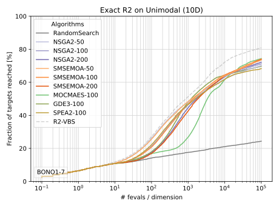
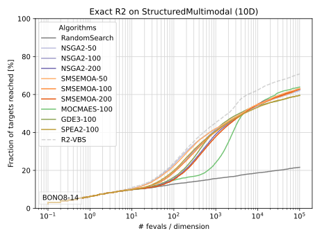
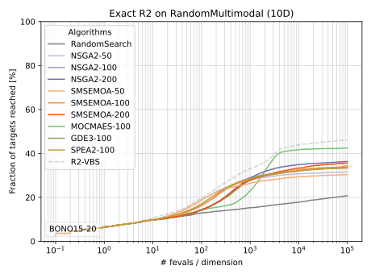
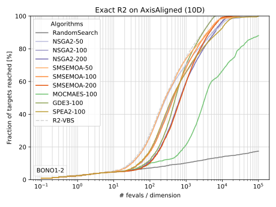

# bonobench

`bonobench` is a Python package for structured benchmarking of bi-objective numerical optimizers.

<p align="center">
  
  
  
  
</p>

## Installation

To install the most recent (unreleased) version of bonobench, you can run:

```sh
pip install git+https://github.com/schaepermeier/bonobench.git
```

A log of all versions and changes is maintained in [CHANGELOG.md](CHANGELOG.md).

## Testing

To run all unittests contained in the [tests](./tests) folder, you can run the following command:

```sh
python -m unittest discover -s tests
```

## BONO-Bench Publication

If you find this package useful, please consider citing our [ACM TELO publication](https://doi.org/10.1145/3795775):

```bibtex
@article{10.1145/3795775,
    author = {Sch{\"a}permeier, Lennart and Kerschke, Pascal},
    title = {BONO-Bench: A Comprehensive Test Suite for Bi-objective Numerical Optimization with Traceable Pareto Sets},
    year = {2026},
    publisher = {Association for Computing Machinery},
    address = {New York, NY, USA},
    issn = {2688-299X},
    url = {https://doi.org/10.1145/3795775},
    doi = {10.1145/3795775},
    note = {Just Accepted},
    journal = {ACM Trans. Evol. Learn. Optim.},
    month = feb,
    keywords = {Multi-objective Optimization, Benchmarking, Performance Assessment, Pareto-optimal}
}
```

Further supplementary material of the publication can be found at: <https://zenodo.org/records/18403177>
